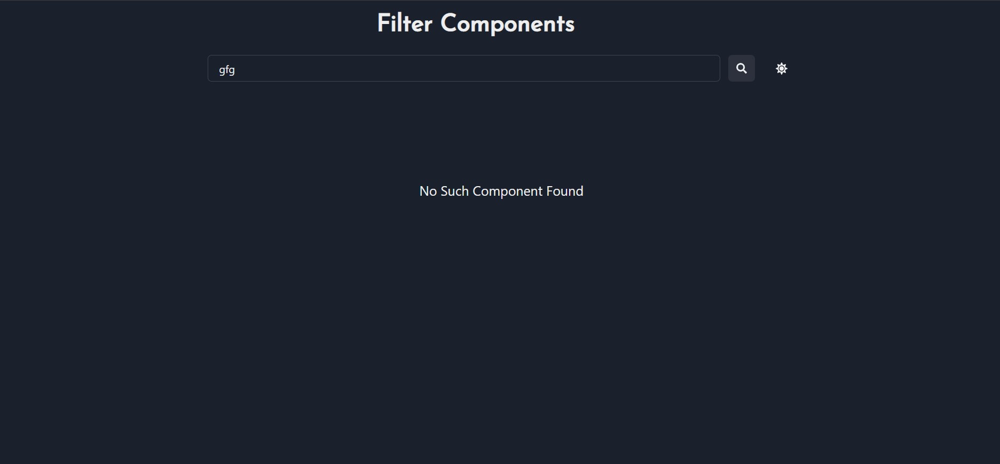
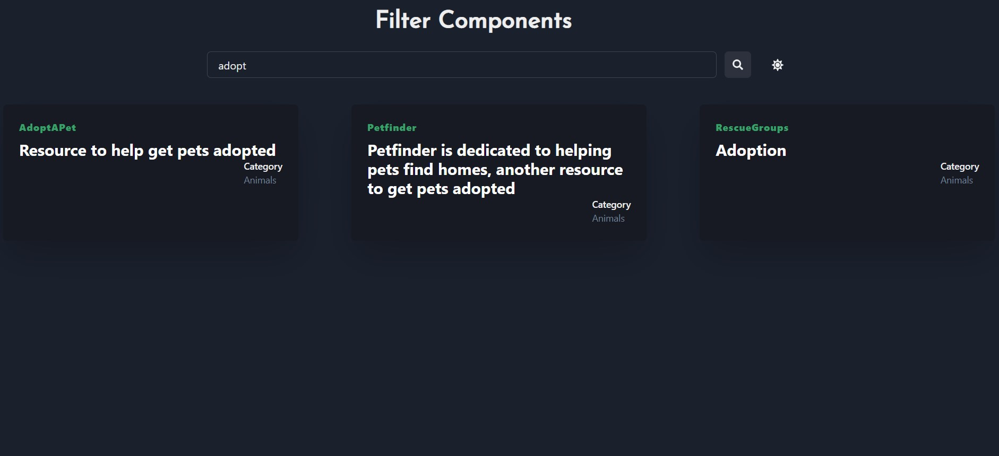

# Filter Components App
> Assignment Submission for MyMegaMinds.

## Requirements  (Prerequisites)

Tools and packages required to successfully install this project.

* NodeJS [Install](https://nodejs.org/en/download/)

## Installation

A step by step list of commands / guide that informs how to install an instance of this project.

* Clone the project

    ```git clone project-url```
* Install Dependencies
    ```npm i```
* Run the Application 
    ```npm start```
## Screenshots

Main Page Dark Mode


Main Page Light Mode


Page when no data matches with Searchkey


Page After Filtering Components 



## Tech Stack / Built With

1. React JS

## Author

Omkar Sanjay Khatale  -  omkarkhatale1002@gmail.com
